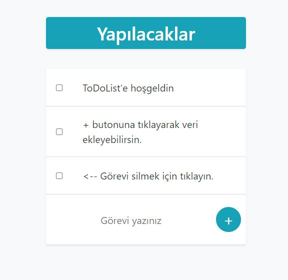

# ToDoList
  
  

## Installation

```
$ git clone https://github.com/SedatBasaran14/todolist.git
$ cd cv
$ npm install
$ npm start
```

### ToDoList

In this project, I have prepared a website where you can make a To-Do list. 
I use; Html, Css, JavaScript, Node.Js


